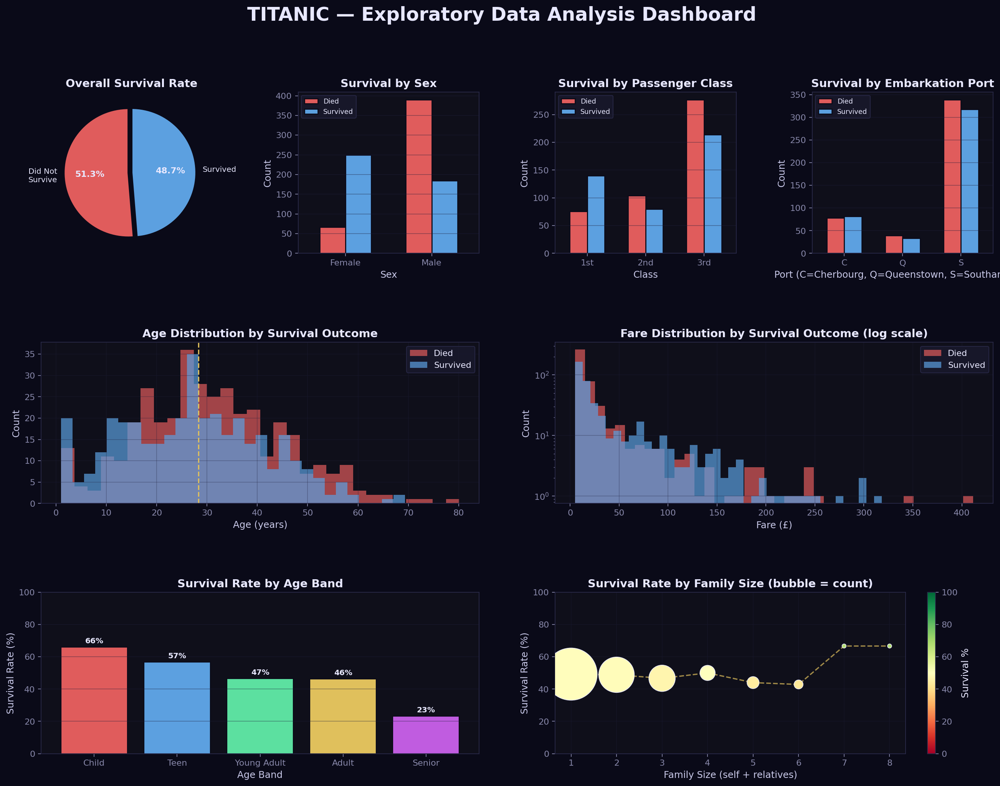
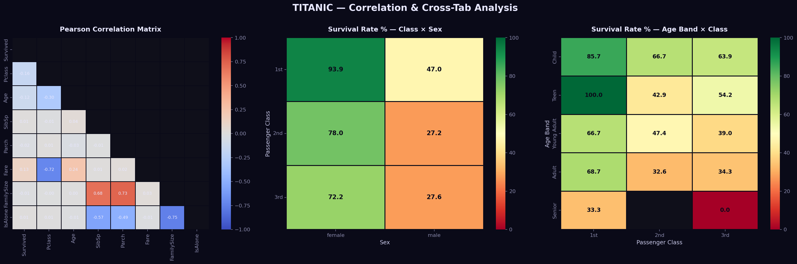
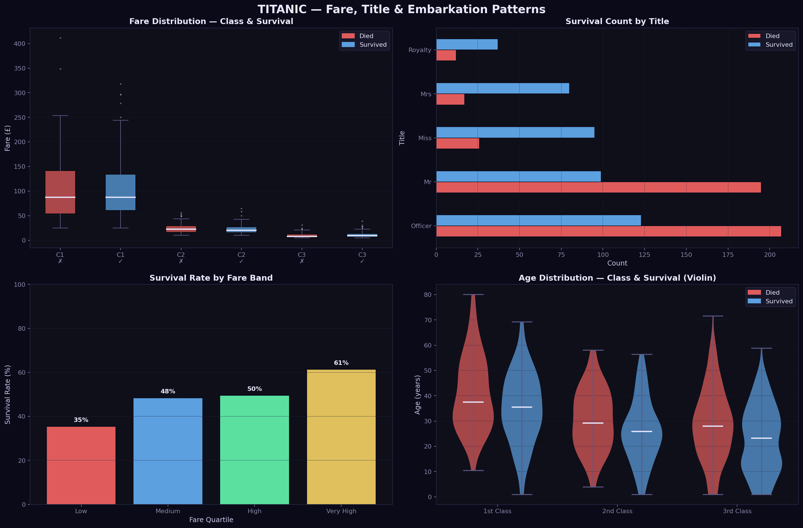

# 🚢 Python & AI Training — Titanic EDA

**Exploratory Data Analysis of the Titanic Dataset using Python**

---

## 📌 Project Overview

This project performs a comprehensive Exploratory Data Analysis (EDA) on the classic Titanic dataset (891 passengers). The goal is to uncover trends, patterns, and insights about what factors influenced passenger survival using Python's data science stack.

---

## 📁 Repository Structure

```
Python-and-AI-Training/
│
├── titanic_eda.py                    # Main EDA Python script
├── titanic.csv                       # Dataset (891 passengers)
├── figure1_dashboard_overview.png    # Dashboard: Survival by sex, class, age, fare
├── figure2_heatmaps_correlations.png # Correlation & cross-tab heatmaps
├── figure3_fare_titles_embarkation.png # Fare, titles & violin plots
└── README.md                         # This file
```

---

## 🔍 EDA Steps Performed

### 1. Data Loading & Inspection
- Loaded 891-row Titanic dataset
- Inspected dtypes, missing values, and summary statistics

### 2. Feature Engineering
- Extracted **Title** from Name (Mr, Mrs, Miss, Dr, Royalty, Officer…)
- Created **FamilySize** = SibSp + Parch + 1
- Created **IsAlone** flag
- Imputed **Age** using median per Title group
- Created **AgeBand** (Child / Teen / Young Adult / Adult / Senior)
- Created **FareBand** (quartile buckets)

### 3. Univariate Analysis
- Age and Fare distributions (histogram)
- Class, Sex, Embarkation counts

### 4. Bivariate & Multivariate Analysis
- Survival rate by Sex, Pclass, Embarked, AgeBand, FareBand, FamilySize
- Pearson correlation heatmap
- Pivot heatmaps: Class × Sex, Age Band × Class
- Box plots, Violin plots, Scatter bubbles

---

## 📊 Key Insights

| Finding | Detail |
|---|---|
| 🚺 **Women first** | Female survival rate **78.9%** vs male **32.1%** |
| 🎩 **Class matters** | 1st class **64.8%** survived vs 3rd class **43.6%** |
| 👶 **Children prioritised** | Under-12 survival rate **65.9%** |
| 💷 **Higher fare = higher survival** | Strong positive correlation |
| ⚓ **Cherbourg edge** | C-embarkees had highest survival (mostly 1st class) |
| 👨‍👩‍👧 **Family helps** | Passengers with family members slightly outperformed solo travellers |

---

## 🖼️ Visualisations

### Figure 1 — EDA Dashboard Overview


### Figure 2 — Correlation & Cross-Tab Heatmaps


### Figure 3 — Fare, Titles & Age Violin Plots


---

## 🛠️ Tech Stack

| Library | Purpose |
|---|---|
| `pandas` | Data manipulation & aggregation |
| `numpy` | Numerical operations |
| `matplotlib` | Core plotting engine |
| `seaborn` | Statistical heatmaps |

---

## 🚀 How to Run

```bash
# 1. Clone the repo
git clone https://github.com/<your-username>/Python-and-AI-Training.git
cd Python-and-AI-Training

# 2. Install dependencies
pip install pandas numpy matplotlib seaborn

# 3. Run the analysis
python titanic_eda.py
```

All three figures will be saved to the current directory.

---

## 👤 spoorthi 

AI Intern — *Python & AI Training Programme*
